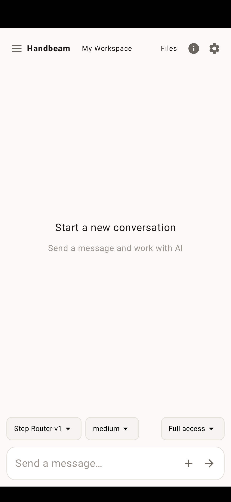

# Handbeam

[English](README.md) · [中文](README.zh.md)

A local agent assistant for autonomous coding. Conversations, tool execution, and long-term memory stay entirely on your machine. The Phoenix LiveView Web UI and native mobile clients (Android and iOS) share the exact same Elixir/OTP runtime core.

- **Workspace control**: Read, edit, and write files, run a shell, fuzzy-search filenames, and locate code positions by symbol or embeddings
- **Granular permissions**: Fine-grained workspace permission policies (auto, prompt, or deny)
- **Streaming & observability**: Real-time response streaming with live tool execution status
- **Broad provider support**: Anthropic and OpenAI-compatible endpoints (StepFun, Ollama, OpenCode Go, DeepSeek, OpenRouter, and more)
- **Extensible runtime**: MCP (Model Context Protocol), BEAM VM introspection, and cross-session memory
- **Unified architecture**: Android, iOS, and Web all run on the same Coordinator and Runner lifecycle

## Inline HTML / interactive widgets (Web)

Ask for a visualization, calculator, or small interactive UI in Web chat. Assistant
`html` / `widget` fences render inline with streaming static previews, source view,
and copy. Inline JavaScript runs after the closing fence. History stays Markdown;
reopening restores previews, not transient input state.

An iframe sandbox without `allow-same-origin` isolates application DOM, cookies,
storage, and host tools. CSP blocks external scripts, fetches, and form submissions;
widgets must be self-contained, without CDN dependencies. This is not an OS-level
or fully network-isolated sandbox: frame navigation remains governed by browser
rules. Android / iOS native chat still displays code, without inline previews.

## App screenshot

Native Android chat interface, captured on a physical device:



### On-device Elixir projects (experimental)

Create, edit, test, and run Elixir/Mix projects directly on your phone through natural dialogue. The agent uses the app's bundled Elixir/OTP runtime via `mix_project` without requiring a separate Linux environment or chroot:

- **Dependency support**: Supports pure Elixir/Erlang dependencies compatible with the bundled host version. C extensions (NIFs) and external toolchains are rejected.
- **Execution environment**: Code runs inside the app's BEAM VM. It is not an isolated sandbox; only run code you trust.
- **Platform status**: End-to-end chat workflows are verified on physical Android devices. iOS is currently verified in the simulator only.

## Web UI standalone packages

Prebuilt packages with a bundled OTP runtime are available on GitHub Releases under `web-latest` and version tags. Extract and run without installing Elixir:

| Platform / Architecture | Package | How to run |
|---|---|---|
| Linux (x86_64) | `handbeam-web-linux-x86_64.tar.gz` | Run `./start.sh` |
| macOS (Apple Silicon) | `handbeam-web-macos-arm64.tar.gz` | Run `./start.sh` |
| macOS (Native WebKit App) | `Handbeam-macos-arm64.zip` | Launch `Handbeam.app` (native WebKit shell, zero Electron overhead) |
| Windows (x86_64) | `handbeam-web-windows-amd64.zip` | Run `start.bat` |
| Windows (with toolchain, experimental) | `handbeam-web-windows-amd64-toolchain.zip` | Prepend bundled Elixir, Mix, Hex, Rebar3, and MinGit to process `PATH` |

**Notes**:
- **Default address**: Standalone release packages serve on `http://localhost:5008`.
- **Windows terminal**: The in-browser terminal is omitted on Windows because Ghostty lacks a Windows native NIF.
- Windows ARM64 builds are not currently published.

## Run from source

### Prerequisites
- **Elixir**: `>= 1.20.0`
- **Erlang/OTP**: `28+`
- **Node.js** (for asset bundling)

### Setup & run

```bash
# 1. Configure model credentials (specify apiKey or export OPENAI_API_KEY)
cp models.example.json models.json

# 2. Install dependencies and build assets
mix setup

# 3. Start development server (serves on http://localhost:5002)
mix phx.server
```

Open `http://localhost:5002` in your browser and select a workspace directory to begin.

### Asset development

- Frontend source files live in `assets/`. Compiled bundles in `priv/static/assets/` are not committed to git.
- Styles are organized under `assets/css/`, with baseline styles in `assets/default.css`.
- `mix setup` installs dependencies and builds assets. To build assets alone, run `mix assets.setup` followed by `mix assets.build`.
- `mix phx.server` automatically watches frontend files and recompiles them on change. For production builds, `mix assets.deploy` minifies assets and generates digests.
- `mix compile` compiles Elixir source code only.

### Running tests

```bash
mix test --exclude slow --exclude e2e
```

## Inspect effective host configuration

Inspect your resolved runtime configuration safely without booting the full server, initializing file stores, resolving credentials, or connecting to MCP servers:

```bash
mix handbeam.inspect_config --workspace /path/to/workspace
```

Within a running host session, call `Handbeam.ConfigInspection.report(workspace: path)`.

**Key features**:
- **Layered decision breakdown**: Separates Host seed capabilities, registered tool membership, passive dependency checks, and runtime authorizations.
- **Precedence hierarchy**: Global settings override defaults; workspace settings override global settings; runtime provider environment variables take precedence over catalog values.
- **Automatic redaction**: Automatically suppresses absolute filesystem paths, model identifiers, permission patterns, dynamic tool names, endpoints, secrets, and prompt text for safe sharing.
- **Non-intrusive diagnosis**: Pure static analysis. Does not execute external commands, native callbacks, or live network probes.

## ChatGPT / Codex subscription login

If you have a ChatGPT subscription with Codex access, you can sign in directly without setting up prepaid API credits:

1. In Web UI, navigate to **Settings → Available models → Subscription login** and select **ChatGPT (Codex subscription)**.
2. Enter the device code on the OpenAI verification page, then pick a model from this provider.
3. Use the **Refresh subscription models** button to update the model catalog.

**Details**:
- No Codex CLI required. Inference connects directly to the Codex Responses backend; Handbeam handles tool execution and permission prompts.
- Uses your ChatGPT Codex subscription allowance, not Platform API credits. Available models and rate limits are dictated by your account plan.
- Auth credentials are stored locally in `~/.handbeam/auth.json` (mode `0600`). Never share or commit this file.
- The native mobile settings UI does not currently support device login.

## Private Git repository authentication

The `git` tool takes a named credential reference (`credential`), never raw tokens or passwords.

Configure credentials in the trusted host at startup rather than in workspace settings or chat messages. For example, in host runtime configuration:

```elixir
config :handbeam, :git_credentials, %{
  "project-origin" => [
    endpoint: "https://github.com",
    password: System.fetch_env!("PROJECT_GIT_TOKEN")
  ]
}
```

The agent invokes the tool with:
```json
{"action": "push", "credential": "project-origin"}
```

**Security boundaries**:
- Fresh authentication challenges must match the configured HTTPS endpoint.
- libgit2 rejects cross-host redirects and HTTPS downgrades, but may reuse credentials across other ports or paths on the same hostname.
- **Configuring credentials trusts all HTTPS services on that hostname**; it does not isolate by port or repository path. Avoid configuring credentials for hosts serving untrusted tenants, and prefer repository-scoped, least-privilege tokens.
- Omit `credential` for anonymous read access. Mobile hosts can inject the same startup configuration.

## Mobile development (Android + iOS)

```bash
cd mobile
mix deps.get
mix test

# Build Android APK
bash script/pack_android_apks.sh --abi arm64-v8a

# Launch iOS Simulator (requires macOS and Xcode)
mix ios.native
```

See [`mobile/README.md`](mobile/README.md) for full instructions. Use `--abi x86_64` on ChromeOS. The iOS test app Bundle ID is `com.example.handbeam_probe`.

## License

Source and non-iOS builds are licensed under [FSL-1.1-ALv2](LICENSE). Copyright (C) 2026 youfun.

iOS builds that statically link [ish-arm64](https://github.com/youfun/ish-arm64) are licensed under [GPLv3](LICENSE.GPLv3). The corresponding source for that binary, including the Handbeam code linked into it, is offered under GPLv3. See [LICENSE.iOS](LICENSE.iOS).
