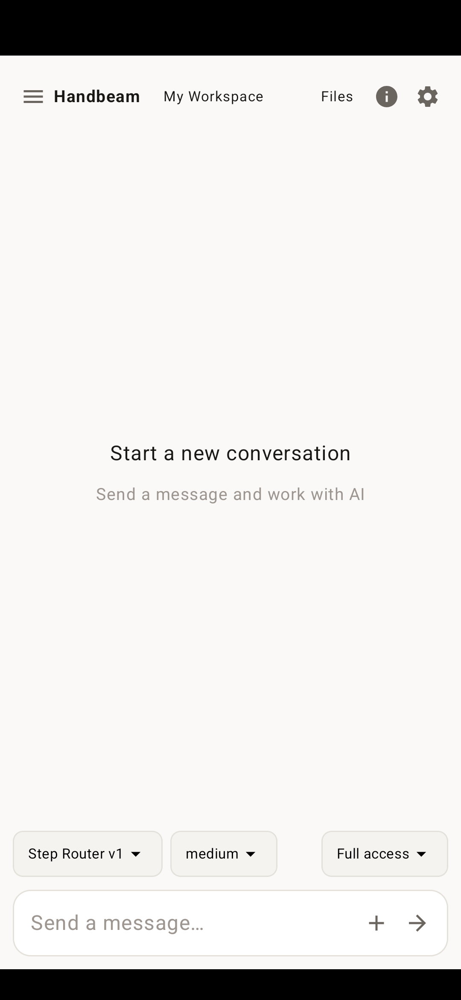

# Handbeam

[English](README.md) · [中文](README.zh.md)

本地 agent 助手。对话、工具、记忆都在本机；一套 OTP runtime，[LiveView](lib/handbeam_web/live) 和 [mobile](mobile/)（Android + iOS）共用。`code_search` 按符号或已配置的 embeddings 返回路径和行号，文件内容仍走 `read`。

- 读、改、写文件，跑 shell，模糊搜文件
- 工作区权限（auto / prompt / deny）
- 流式回复和工具状态
- Anthropic / OpenAI 兼容协议（StepFun、DeepSeek、OpenRouter 等）
- MCP、BEAM 内省、跨会话记忆
- Android / iOS 共用同一套 Coordinator / Runner

## 应用截图

Android 原生聊天主界面，英文界面真机截图。



### 手机端 Elixir 项目编程（实验性）

在手机上通过对话，让 Agent 在工作区创建、编辑和运行 Elixir/Mix 项目。基于应用内置的 Elixir/OTP，支持通过 `mix_project` 获取依赖、编译、测试和运行，无需额外安装 Linux 环境。

- 支持与宿主版本兼容的纯 Elixir/Erlang 依赖；不支持的原生构建、外部工具链及宿主依赖版本冲突会被拒绝。
- 项目代码在应用的 BEAM VM 中执行，并非独立虚拟机或安全沙箱，请仅运行可信代码。
- 已通过 Android 真机的对话驱动端到端验证；iOS 目前仅完成模拟器验证，尚未完成真机及完整发行构建验证。

需要 Elixir 1.20、OTP 28+、Node。

## 运行

```bash
cp models.example.json models.json   # 填 apiKey，或用 env:OPENAI_API_KEY
mix setup
mix phx.server                       # http://localhost:5002
```

选一个工作区即可聊天。CSS 和 JavaScript 源文件放在 `assets/`，生成的
`priv/static/assets/` 不提交 Git。原有样式保留在 `assets/css/`，预生成的基础样式保留在
`assets/default.css`，均作为资源构建的输入。

`mix setup` 会安装依赖并构建资源。只处理资源时，依次运行 `mix assets.setup` 和
`mix assets.build`。开发时 `mix phx.server` 自动监听 CSS / JS 修改并重建；发布时使用
`mix assets.deploy` 压缩资源并生成 Phoenix digest。`mix compile` 只编译 Elixir。

```bash
mix test --exclude slow --exclude e2e
```

## Git 私有仓库认证

`git` 工具只接受凭据名称（`credential`），不接受密码或 PAT。
由可信宿主在启动时配置凭据；不要把配置写入 Agent 可编辑的工作区设置，
也不要在对话中粘贴密钥。例如在宿主的运行时配置中：

```elixir
config :handbeam, :git_credentials, %{
  "project-origin" => [
    endpoint: "https://github.com",
    password: System.fetch_env!("PROJECT_GIT_TOKEN")
  ]
}
```

工具参数只需 `{"action":"push","credential":"project-origin"}`。
新的认证挑战必须匹配配置的 HTTPS endpoint。
libgit2 拒绝跨主机重定向和 HTTPS 降级，
但可能在同一主机的其他 HTTPS 端口或路径复用凭据。**配置凭据意味着信任该主机上的全部
HTTPS 服务，不提供端口或仓库路径隔离。** 不要为包含不可信服务的主机配置凭据；
同时应使用最小权限、仅授权目标仓库的 PAT。
省略 `credential` 时匿名访问。手机宿主同样可以在启动时注入该配置；
目前没有新增凭据管理 UI。历史对话中已经出现过的密钥不会被自动清除，应撤销并更换。

## Mobile（Android + iOS）

```bash
cd mobile
mix deps.get
mix test
bash script/pack_android_apks.sh --abi arm64-v8a   # Android
mix ios.native                                     # iOS 模拟器（需 Xcode）
```

说明见 [`mobile/README.md`](mobile/README.md)。ChromeOS 用 `--abi x86_64`。
iOS 包名 `com.example.handbeam_probe`；模拟器 Dist 节点为
`handbeam_probe_ios_<UDID 前 8 位>@127.0.0.1`。

## 许可

[AGPL-3.0](LICENSE)。Copyright (C) 2026 youfun。
